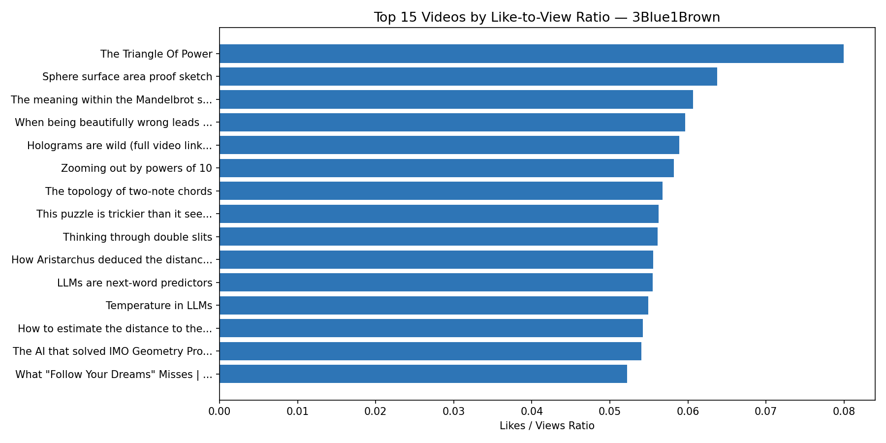
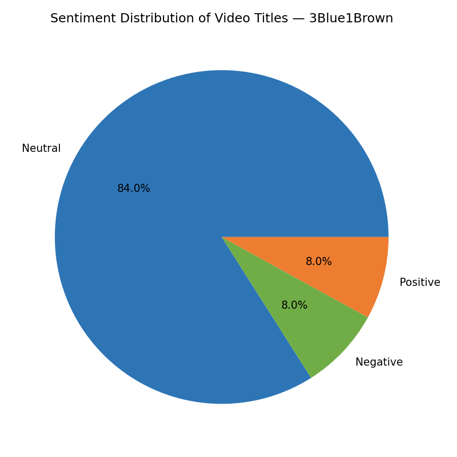
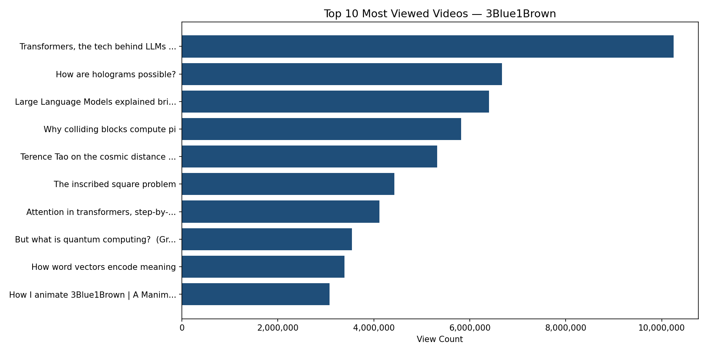
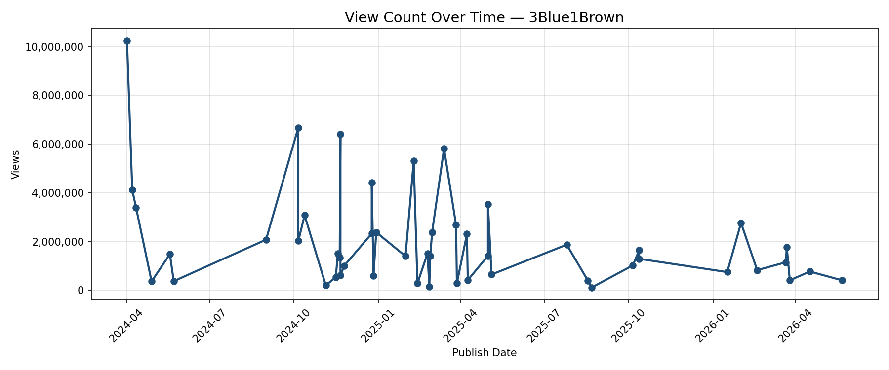

# youtube analytics

# 3Blue1Brown YouTube Analytics Pipeline

An end-to-end solo analytics pipeline that extracts video metadata and statistics from the YouTube Data API v3, performs engagement and sentiment analysis, and exports results to SQLite and a styled Excel report with embedded charts.

---

## What It Does

| Step | Function | Output |
|------|----------|--------|
| 1 | Fetch video metadata via YouTube API | DataFrame |
| 2 | Analyse engagement ratios + title sentiment | Enriched DataFrame |
| 3 | Visualise trends and distributions | 4 × `.png` charts |
| 4 | Export to SQLite + run SQL queries | `.db` file |
| 5 | Export styled Excel report | `.xlsx` workbook |

---

## Sample Output

**Most Viewed Video:** Transformers, the tech behind LLMs — 10.2M views  
**Highest Like Ratio:** The Triangle of Power — 8.0% like-to-view ratio  
**Sentiment (50 videos):** 42 Neutral · 4 Positive · 4 Negative

### Charts Generated
- `chart_views_over_time.png` — view count trend across publish dates
- `chart_top10_views.png` — top 10 most viewed videos
- `chart_like_ratio.png` — top 15 by like-to-view ratio
- `chart_sentiment.png` — sentiment distribution pie chart

---

## Setup

### 1. Install dependencies
```bash
pip install requests pandas matplotlib textblob openpyxl
```

### 2. Get a YouTube Data API v3 key
1. Go to [Google Cloud Console](https://console.cloud.google.com/)
2. Create a project → Enable **YouTube Data API v3**
3. Create an API key under Credentials

### 3. Set your API key as an environment variable

**Windows:**
```bash
set YOUTUBE_API_KEY=your_key_here
```

### 4. Run the pipeline
```bash
python a4_pipeline.py
```

---

## Output Files

| File | Description |
|------|-------------|
| `3b1b_analytics.db` | SQLite database with full video data |
| `3b1b_analytics_report.xlsx` | Styled Excel workbook (5 sheets) |
| `chart_views_over_time.png` | Line chart — views over time |
| `chart_top10_views.png` | Bar chart — top 10 most viewed |
| `chart_like_ratio.png` | Bar chart — top 15 by like ratio |
| `chart_sentiment.png` | Pie chart — title sentiment |

### Excel Workbook Sheets
1. **Overview** — summary stats and key findings
2. **Video Data** — full table of all 50 videos
3. **Engagement Analysis** — top 15 by like-to-view ratio with embedded bar chart
4. **Sentiment Analysis** — sentiment breakdown with embedded pie chart
5. **SQL Query Results** — output of 4 analytical SQL queries

---

## SQL Queries Included

- Top 10 most viewed videos
- Top 10 by like-to-view ratio
- Average engagement metrics grouped by sentiment
- Videos with above-average view counts

---

## Tech Stack

- **Python** — core language
- **YouTube Data API v3** — data source
- **pandas** — data manipulation
- **TextBlob** — NLP sentiment analysis
- **matplotlib** — data visualisation
- **SQLite** — structured storage and querying
- **openpyxl** — Excel report generation

---

## Configuration

To analyse a different YouTube channel, update these two constants at the top of `a4_pipeline.py`:

```python
CHANNEL_ID = "any channel ID"  
N = Number of videos to fetch (max 50 per request)
```

## Charts & Analytics








